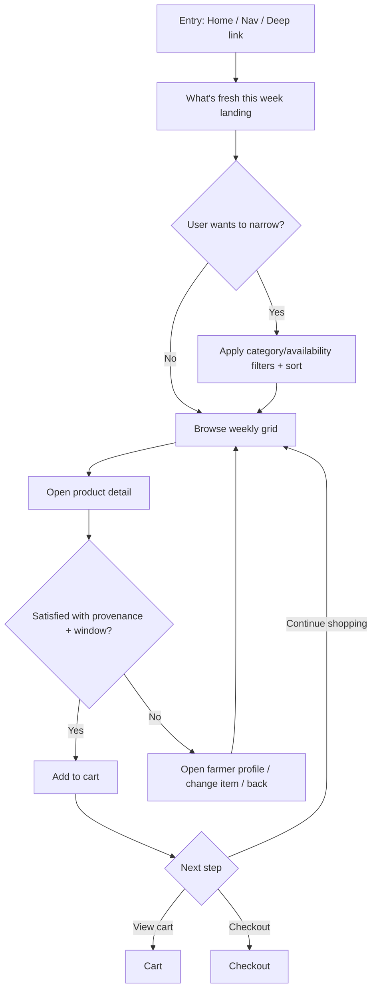
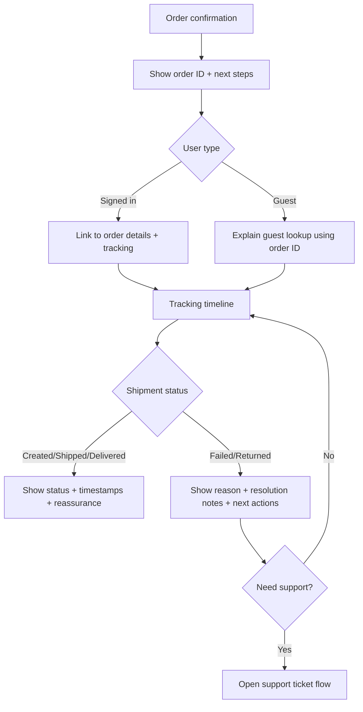
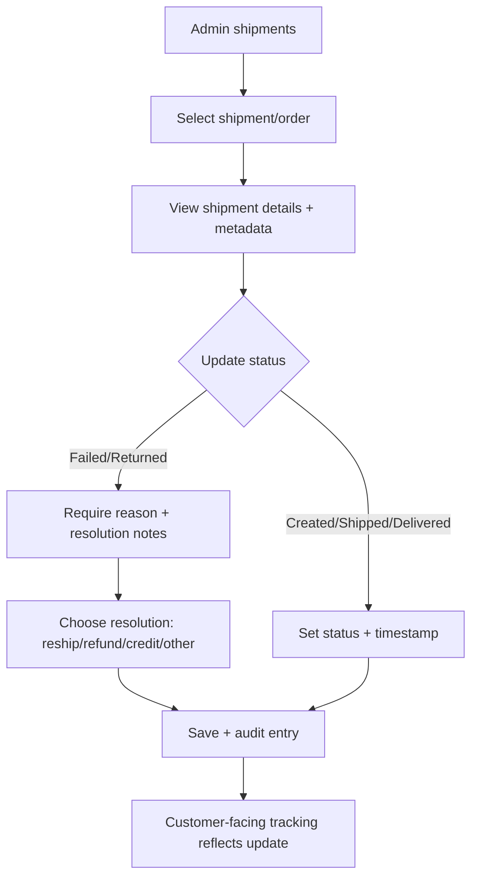

# UX Design Specification FreeMarket

**Author:** andyalv
**Date:** 2026-02-03T00:37:37-06:00

---

## Executive Summary

### Project Vision

FreeMarket is a fresh, modern online store for high-quality, organic, locally obtained food. The UX should feel slick and contemporary while also warm and endearing—grounded in the “local farm” concept—so customers feel connected to where their food comes from.

The product is not trying to reinvent e-commerce; it aims to deliver a familiar, trustworthy purchase flow (browse → product → cart → checkout → tracking) with elevated visual design and clarity.

### Target Users

- Primary customers: people of all ages and varying comfort with technology who want an easy way to buy local, organic food online.
- Secondary users: management/admin staff running products, inventory, orders, and shipments; they handle tickets in MVP (no separate Support role).

Key user attributes:

- Not tech-savvy (design must be simple, guided, and forgiving).
- Trust-sensitive (needs clear signals of quality, local sourcing, freshness, and reliable fulfillment).

### Key Design Challenges

- Simplicity for all ages: reduce cognitive load, avoid jargon, and make navigation + checkout steps obvious.
- Trust & “local farm” connection without clutter: express sourcing/freshness/story in a calm, scannable way (especially on product detail and checkout).
- Payment and verification states: make “processing / success / failure / retry” unmistakable without anxiety.
- Shipment tracking clarity: communicate status and exceptions (failed/returned) in plain language with clear next actions.
- Discounts/loyalty stacking: show eligibility and applied discounts transparently without making the checkout feel complicated.

### Design Opportunities

- Farm-to-table storytelling as UI: tasteful visuals, tone of voice, and product detail “proof points” (local origin, harvest/batch info when available) that build confidence quickly.
- A “confidence-first” checkout: clear totals, delivery expectations, and what happens next (confirmation + tracking) with minimal friction.
- A delightful but simple UI system: high-contrast, readable typography, large tap targets, and consistent components that feel premium while remaining accessible.
- Loyalty that feels helpful: surfaced gently in account/cart/checkout as “you qualify” guidance rather than marketing noise.

## Core User Experience

### Defining Experience

The core experience of FreeMarket is helping customers of all ages confidently buy high-quality, organic, locally obtained food through a familiar e-commerce flow that feels premium, warm, and farm-connected. Users should be able to discover what’s available, understand why it’s trustworthy, complete checkout without confusion, and track their order with reassurance.

### Platform Strategy

- App framework: Next.js (App Router) with hybrid rendering — Server Components by default and Client Components where interactivity is required (cart, checkout, forms).
- Primary platform: desktop-first responsive web storefront optimized for laptop/desktop shopping.
- Secondary support: ensure the experience still works on smaller screens without prioritizing mobile-first patterns.
- PWA: not a priority for the current phase.
- Browser support: latest Chrome and Edge required; Firefox best-effort; Safari not required for MVP.
- Language: English-only (Texas-based business).
- Usability posture: while formal accessibility compliance is not a stated priority, the UI should remain easy to read and understand for non tech-savvy users (clear hierarchy, plain language, forgiving interactions).

### Effortless Interactions

- Browsing and discovery should require minimal reading and decision fatigue (clear categories, “local/fresh” cues, consistent product cards).
- Product details should answer trust questions quickly (local sourcing, quality, harvest/batch info when available) with scannable “proof points”.
- Cart adjustments should be frictionless and forgiving (clear totals, easy quantity edits, no surprise fees).
- Checkout should be guided and resilient, especially around payment/verification states (“processing / success / failure / retry”).
- Order confirmation and tracking should be confidence-first (what’s next, where to track, clear shipment status language; guest order lookup supported).

### Critical Success Moments

- Trust moment: the user sees a product and immediately feels confident it’s local, organic, and high quality.
- Checkout success: the user completes payment without confusion and receives a clear confirmation.
- Post-purchase reassurance: the user can easily track shipment status and understand exceptions with next-step guidance.
- Failure prevention: payment verification and shipment status changes never leave the user uncertain about whether an order “worked”.

### Experience Principles

- Familiar flow, elevated feel.
- Clarity beats cleverness.
- Trust through calm transparency.
- No dead ends: every state provides a next action.
- Simple enough for all ages.

## Desired Emotional Response

### Primary Emotional Goals

- Calm confidence: users feel safe buying food online because the experience is clear, honest, and predictable.
- Warm local connection: users feel connected to the “local farm” concept through tone, visuals, and transparent product details.
- Pride in purchase: users feel good about buying organic/local products and feel reassured they made a high-quality choice.

### Emotional Journey Mapping

- Home / Entry: welcoming, modern, quietly confident (“this is a quality local shop”).
- Shop / Browse: easy and unrushed; users feel oriented and in control.
- Product Detail: trust peaks here—users quickly feel “this is real, local, and high quality.”
- Cart: calm and clear; no surprises; users feel prepared to check out.
- Checkout: guided and reassuring; “I know what to do and what happens next.”
- Payment Processing/Verification: reduced anxiety through clear status language and next actions (retry/return).
- Confirmation: relief + satisfaction; “it worked” plus a warm thank-you and clear next steps.
- Tracking / Order Lookup: reassurance and control; status is understandable, and exceptions (failed/returned) are explained with next actions.

### Micro-Emotions

- “I understand what I’m buying” (clarity + plain language).
- “I can trust this is genuinely local/organic” (proof points, not marketing fluff).
- “This looks premium but feels simple” (slick UI without complexity).
- “Nothing surprising happened” (transparent totals, discounts, delivery expectations).
- “I’m not stuck” (error states always offer a next step).

### Design Implications

- Trust through calm transparency: show local/organic proof points in a scannable way (badges, short facts, optional deeper details).
- Warmth without clutter: use tasteful farm-connected visuals and copy, but keep layouts clean and modern.
- Reduce anxiety at critical points: checkout and tracking use clear status messaging, strong hierarchy, and obvious next actions.
- Avoid “sales pressure” patterns: keep loyalty/discount messaging helpful and gentle, not pushy or confusing.

### Emotional Design Principles

- Calm, honest, and predictable beats flashy.
- Warm and endearing, but still modern and minimal.
- Trust is earned through clarity and proof, not claims.
- Every state communicates “what’s happening” and “what to do next.”
- Keep the UI premium-looking while remaining simple enough for all ages.

## UX Pattern Analysis & Inspiration

### Inspiring Products Analysis

Since we didn’t pick specific reference sites, this analysis uses proven patterns from “warm-artisanal” commerce experiences (farm/CSA-style shops, specialty food brands, and boutique DTC stores) that combine modern usability with an endearing, local feel.

Common strengths of warm-artisanal exemplars:

- They make products feel “real” with provenance details (where it comes from, when it was harvested/produced, who made it).
- They keep buying simple while using tasteful storytelling to build trust.
- They use a calm, friendly tone and photography to create connection without adding friction.

### Transferable UX Patterns

- Provenance panel (product detail): a compact “From the farm” block with 3–6 scannable proof points (origin, harvest/batch date, farming practices, storage tips, seasonality).
- Seasonal framing: “What’s fresh this week” / “In season now” modules that help non-tech-savvy users decide quickly.
- Simple category-first navigation: clear top-level categories + a “Fresh picks” area to reduce decision fatigue.
- Warm trust cues: short, human copy (“Grown nearby”, “Picked this week”) paired with subtle icons/badges (kept factual, not salesy).
- Clean layout with warm visuals: modern grid, generous spacing, strong hierarchy; warmth comes from photography, tone, and microcopy—not clutter.
- Reassuring checkout summary: persistent order summary with plain-language totals, discounts, and a clear “what happens next”.
- Confidence-first confirmation: confirmation page that emphasizes next steps (email sent, tracking, guest lookup instructions) and sets expectations clearly.
- Tracking clarity pattern: status timeline with simple verbs and timestamps; exceptions (failed/returned) include immediate “what we’re doing / what you can do” guidance.

### Anti-Patterns to Avoid

- Over-storytelling above the fold that hides shopping (users can’t find products quickly).
- “Farm aesthetic” that sacrifices readability (low contrast, tiny type, overly decorative fonts).
- Pushy marketing patterns (aggressive popups, forced newsletter gates, confusing discount games).
- Hidden shipping/taxes/fees until late checkout (breaks trust).
- Jargon-heavy labels (e.g., agricultural terms without plain-language explanation).
- Unclear payment/verification states (anxiety: “Did it work?”).
- Tracking pages that show a status without meaning or next actions.

### Design Inspiration Strategy

**What to Adopt:**

- Scannable provenance details as a primary trust mechanism (product detail + confirmation + tracking).
- Calm, warm tone and photography layered onto a modern, simple layout.
- Seasonal “freshness” framing to help users decide quickly.

**What to Adapt:**

- Artisanal visual language (textures, earthy palette, warm imagery) but keep hierarchy and readability modern.
- Storytelling: keep it optional (expand/collapse or secondary sections) so shopping stays fast.

**What to Avoid:**

- Anything that makes buying harder to find than brand messaging.
- Visual complexity that reads as “pretty but confusing”.
- Any dark-pattern growth tactics that conflict with trust and simplicity.

## Design System Foundation

### 1.1 Design System Choice

**Chosen foundation:** Tailwind CSS + shadcn/ui components (React) with a hybrid approach:

- Use shadcn/ui for core, standardized UI building blocks (forms, dialogs, tables, toasts, inputs, buttons).
- Build custom “FreeMarket signature” components for brand-defining surfaces (homepage modules, product card system, provenance panel, seasonal modules, tracking timeline).

### Rationale for Selection

- Balance of speed + uniqueness: shadcn/ui accelerates building reliable UI while still allowing deep customization for a warm-artisanal FreeMarket brand.
- Works well with the chosen stack: Next.js App Router + React + Tailwind CSS (with Bun used to run Next scripts) aligns with shadcn’s patterns and keeps UI composition consistent.
- Design control: Tailwind enables precise tuning of spacing, typography, and color so the UI can stay modern while expressing warmth through visuals and tone.

### Implementation Approach

- Establish design tokens in Tailwind:
  - Color palette (earthy/warm neutrals with a modern contrast color for CTAs)
  - Typography scale for desktop-first layouts
  - Spacing and radius rules for consistent “premium but friendly” surfaces
- Standardize core components early (via shadcn/ui):
  - Buttons, inputs, selects, checkboxes, radios
  - Dialogs/drawers, toasts, alerts
  - Form patterns for checkout and admin CRUD
- Compose page-level patterns from components:
  - Product listing grid, filters/sort, product detail layout, cart, checkout
  - Confirmation and tracking views with status states

### Customization Strategy

**Adopt (from library):**

- Everything that should be predictable and consistent (forms, dialogs, confirmations, error states).

**Custom-build (signature FreeMarket):**

- Product card + product detail “From the farm” provenance panel (scannable proof points)
- Seasonal “What’s fresh this week” modules
- Trust cue components (badges, microcopy patterns, provenance highlights) that remain factual and calm
- Tracking timeline presentation and exception-state modules (failed/returned guidance)

**Guardrails:**

- Keep layouts clean and modern; warmth comes from imagery and copy, not UI clutter.
- Ensure desktop-first density: comfortable spacing and hierarchy for large screens while still functional on smaller screens.

## 2. Core User Experience

### 2.1 Defining Experience

FreeMarket’s defining experience is a “What’s fresh this week” seasonal landing flow that makes local provenance instantly visible and effortlessly shoppable. Users begin with a curated weekly selection, quickly understand where items come from and when they were harvested/produced, then move through a familiar cart/checkout path without friction.

This keeps the e-commerce mechanics standard, but makes the decision-making feel uniquely FreeMarket: “I’m buying something local, I can see the source, and I can trust when/how I’ll get it.”

### 2.2 User Mental Model

Users should feel like they’re shopping a modern version of a local farmers market / weekly harvest list:

- Start with what’s available this week (curated and limited in a reassuring way).
- Pick items based on origin and freshness signals (not technical filters).
- Expect clear availability/delivery windows (so there’s no uncertainty).
- Feel a human connection via farmer profiles (optional depth, not required reading).

### 2.3 Success Criteria

A user is successful when they can:

- Land on “What’s fresh this week” and understand the weekly offer within seconds.
- Open a product and immediately see the 4 core proof points:
  - Farm/origin
  - Harvest/batch date
  - Delivery/availability window
  - Farmer profile (link or short snippet)
- Add items to cart confidently without needing extra explanation.
- Complete checkout without confusion and feel reassured about what happens next (confirmation + tracking).

Operational success indicators:

- Low abandonment on weekly landing → product detail → cart.
- Low customer confusion about availability/delivery timing.
- High engagement with provenance elements (especially farm/origin and harvest/batch date).

### 2.4 Novel UX Patterns

This experience is primarily built on established patterns (catalog browsing, product detail pages, cart/checkout), with a FreeMarket-specific twist:

- The “What’s fresh this week” seasonal landing module functions as the default storefront entry point (curation-first), which is familiar to grocery/CSA concepts but differentiated by making provenance a primary decision tool.
- Provenance is presented as scannable proof points rather than long-form storytelling, keeping it accessible for non tech-savvy users.

### 2.5 Experience Mechanics

**1. Initiation**

- Entry points: Home → “What’s fresh this week” (default) and/or primary nav.
- The weekly module clearly signals “fresh now” and “local source” as the main value.

**2. Interaction**

- User browses a curated weekly grid/list.
- Each product card surfaces at least one provenance cue (e.g., farm/origin or “harvested on”).
- User opens product detail to see the full provenance block + availability/delivery window + farmer profile link/snippet.
- User adds to cart and continues shopping or proceeds to checkout.

**3. Feedback**

- Immediate confirmation on add-to-cart with clear cart totals.
- Availability/delivery window is consistently visible (to prevent uncertainty).
- Provenance proof points remain stable across product detail → cart → confirmation (where applicable).

**4. Completion**

- Checkout completes with clear confirmation messaging.
- Confirmation provides next steps: order ID, what happens next, and where to track (including guest lookup).

## Visual Design Foundation

### Color System and Gradients

**Brand palette (FreeMarket):**

- Clay Brown: #7f5539
- Tan: #a68a64
- Cream: #ede0d4
- Sage: #656d4a
- Forest: #414833

**Theme intent (Garden, warm-artisanal):**

- Backgrounds should feel calm and light (Cream as the primary canvas).
- Greens communicate “fresh/local” and should be used for supportive emphasis rather than neon accents.
- Browns communicate warmth and craft; use for primary actions and key highlights in the core experience.

**Suggested semantic mapping:**

- `bg`: #ede0d4
- `surface/card`: light tint of #ede0d4 (or white) with warm border accents
- `text primary`: #414833
- `text secondary`: #656d4a
- `primary CTA` (core app): #7f5539
  - In the Garden Editorial direction specifically, primary CTAs on hero/marketing surfaces may use a solid garden green (e.g. #15803d) to emphasize freshness while staying calm next to clay and tan.
- `secondary/outline`: #a68a64
- `success`: #656d4a (sage-based)
- `warning`: #a68a64 (tan-based)
- `error`: use a muted red outside the brand set (kept minimal and consistent)
- Gradients and surfaces:
- --gradient-cta: linear-gradient(135deg, #7f5539 0%, #a66864 60%, #656d4a 100%);
- --gradient-hero: linear-gradient(135deg, rgba(111,160,108,0.25) 0%, rgba(102,109,74,0.25) 100%);
- Gradients are used to add depth to hero sections, section headers, and card/thumbnail surfaces.
- Use gradients sparingly to preserve readability and accessibility.
- Ensure text on gradient backgrounds maintains sufficient contrast by using overlays or solid text colors.
- Gradient tokens should be declared in the root and referenced in components:
-  --gradient-cta, --gradient-hero, etc.
- Updated semantic mapping notes:
-  `--gradient-cta`, `--gradient-hero` for surfaces requiring depth.
- `borders/dividers` maintain low contrast on gradient surfaces.

**Usage rules:**

- Keep CTAs consistent: primary actions use Clay Brown in the core app; in the Garden Editorial direction, storefront hero and weekly modules use a solid garden green CTA instead of a bright gradient.
- Avoid “green everywhere”; reserve Sage/Forest/solid garden green for provenance, freshness cues, and the Garden Editorial CTA treatment, not for every control.
- Gradients should reinforce brand warmth and depth on containers (hero ribbons, section rails, cards), not on the Garden Editorial primary buttons themselves.
- Use overlay layers for text readability on gradient backgrounds.
- Ensure accessibility by checking contrast ratio against WCAG guidelines (target contrast > 4.5:1 for body text on gradient surfaces).
- Gradient usage should follow a consistent pattern across components: hero banners, section headers, product cards, and CTA backgrounds.

### Typography System

**Direction:** Sans + subtle serif accent (desktop-first, warm-artisanal).

- Sans-serif: primary UI font for readability (navigation, body, forms, tables).
- Serif accent: headings only (H1/H2) to add warmth without reducing clarity.

**Hierarchy guidance (desktop-first):**

- Strong H1/H2 contrast to make pages scannable.
- Body text slightly generous for comfort and clarity.
- Avoid decorative type for controls/forms.

### Spacing & Layout Foundation

**Base spacing unit:** 8px system (Tailwind-friendly).
**Layout feel:** balanced (not dense, not airy).

- Desktop-first max content width with clear gutters.
- Consistent vertical rhythm between sections (avoid “visual noise”).
- Card/grid system for “What’s fresh this week” with comfortable spacing and clear grouping.

**Grid guidance (desktop-first):**

- Product listing: multi-column grid on desktop with predictable card sizes.
- Details pages: two-column layout (imagery + core proof points) with the provenance panel highly scannable.

### Accessibility Considerations

Accessibility compliance is not a formal priority, but FreeMarket’s audience includes all ages and non tech-savvy users, so the UI should remain inherently readable and clear:

- Prefer high-clarity text color (#414833) on light backgrounds (#ede0d4).
- Maintain obvious interactive affordances (clear buttons/links, consistent hover/focus states).
- Avoid low-contrast text and overly subtle UI dividers.

## Design Direction Decision

### Design Directions Explored

We explored three visual directions (see `_bmad-output/planning-artifacts/freemarket-design-directions.html`):

1. Warm Market Minimal — commerce-first, clean and calm
2. Garden Editorial — warm-artisanal with gentle editorial storytelling
3. Warm Utility — pragmatic and dense for fast shopping

### Chosen Direction

**Chosen direction:** 2 — Garden Editorial (gradient-supported, provenance-first)

- This direction embraces modern retail aesthetics using soft gradients on hero and section surfaces, paired with solid, calmer CTAs (garden green on the reference preview) to convey depth and warmth. It stays readable and provenance-first while nodding to bold retail players like Costco, Walmart, and Target in its clarity and scannability.

### Design Rationale

- Aligns with FreeMarket’s emotional goals: calm confidence + warm local connection.
- Supports the defining experience: a “What’s fresh this week” seasonal landing that feels curated and human, while remaining easy to shop.
- Keeps UI modern and readable (desktop-first), using warmth via palette, typography accents, photography, and microcopy rather than clutter.

### Implementation Approach

- Use Tailwind + shadcn/ui as the foundation and implement a hybrid component strategy.
- Encode the FreeMarket “Garden” palette into design tokens and semantic colors.
- Standardize key page patterns (weekly landing, product detail provenance panel, checkout, confirmation, tracking) to maintain consistency.
- Build signature components for seasonal landing modules and provenance-first product surfaces.

## User Journey Flows

### 1) Weekly Discovery (“What’s fresh this week”)

Purpose: make local provenance shoppable by default; reduce decision fatigue with a curated weekly set.



### 2) Product Detail (Provenance-first decision)

Must make the 4 proof points instantly visible:

- Farm/origin
- Harvest/batch date
- Delivery/availability window
- Farmer profile

```mermaid
flowchart TD
  A[Product detail] --> B[Provenance panel (4 proof points)]
  B --> C{Need more context?}
  C -->|Yes| D[Farmer profile (lightweight)]
  D --> B
  C -->|No| E[Select variant/quantity]
  E --> F{Availability window works?}
  F -->|Yes| G[Add to cart]
  F -->|No| H[Suggest alternatives / next window]
  H --> I[Back to weekly list]
  G --> J[Inline confirmation + cart summary]
```

### 3) Checkout (Guest or Signed-in)

Checkout should remain familiar and calm; payment must be resilient.

```mermaid
flowchart TD
  A[Checkout] --> B{Signed in?}
  B -->|Yes| C[Use saved profile (address/contact)]
  B -->|No| D[Guest checkout details]
  C --> E[Shipping/delivery details]
  D --> E
  E --> F[Review order summary (items, discounts, totals)]
  F --> G[Choose payment method: Stripe / PayPal]
  G --> H[Initiate payment]
  H --> I{Payment approved client-side?}
  I -->|Yes| J[Server verifies payment]
  I -->|No| K[Show failure/cancel + retry options]
  J --> L{Verification successful?}
  L -->|Yes| M[Create order + show confirmation]
  L -->|No| N[Show processing/failure + retry]
  K --> G
  N --> G
```

### 4) Confirmation + Tracking (Account + Guest Lookup)

Tracking must reduce uncertainty and explain exceptions with next actions.



### 5) Admin: Product + Inventory Management

```mermaid
flowchart TD
  A[Staff sign-in (Supabase)] --> B[Products dashboard]
  B --> C{Action}
  C -->|Create/Edit product| D[Edit product form]
  D --> E[Set provenance fields (origin/batch/availability)]
  E --> F[Save]
  C -->|Manage variants| G[Variants/SKUs]
  G --> H[Update pricing/attributes]
  H --> F
  C -->|Inventory| I[Inventory counts per SKU]
  I --> J[Adjust stock]
  J --> F
  F --> K[Success toast + return to dashboard]
  D --> L{Validation errors?}
  L -->|Yes| D
```

### 6) Admin: Shipment Management + Exceptions



### Journey Patterns

**Navigation patterns**

- Default storefront entry: “What’s fresh this week” as the primary discovery surface.
- Clear escape hatches: always provide “Back to weekly list” and “View cart”.

**Decision patterns**

- Provenance-first: users decide via farm/origin + harvest/batch + delivery window before price optimization.
- Optional depth: farmer profile is available but never required to complete the flow.

**Feedback patterns**

- Immediate, calm confirmations (add-to-cart, save success, payment processing states).
- Tracking timeline language that always answers: “what’s happening” + “what’s next”.

### Flow Optimization Principles

- Keep the weekly landing scannable: limit choices, emphasize provenance cues, avoid heavy filtering UX.
- Keep checkout predictable: minimal steps; totals visible; clear retry paths for failures/cancellations.
- Make availability/delivery windows consistently visible (product → cart → checkout → confirmation).
- Treat exception states as first-class: failed/returned shipments always show reason + next action.

## Component Strategy

### Design System Components

Use shadcn/ui (Tailwind + React) for standardized, reusable primitives:

- Navigation: dropdown/menu, breadcrumb (where needed)
- Inputs & forms: input, textarea, select, checkbox, radio, form wrapper/validation
- Feedback: toast, alert, badge, tooltip
- Overlays: dialog, drawer/sheet (for cart), popover
- Data display: table (admin lists), tabs (admin sections), pagination (if needed)
- Buttons: primary/secondary/ghost, icon button
- Cards: base card container (extended by custom product cards)
- Status components: skeleton loaders, empty states

### Custom Components

**Signature (FreeMarket-defining)**

1) **Seasonal Landing Module: “What’s fresh this week”**

- Purpose: default discovery surface; curated weekly selection; provenance-first.
- Includes:
  - Header with weekly framing (copy + optional supporting stats)
  - Light filter bar (Category, Delivery Window)
  - Product grid (desktop-first multi-column)
  - “Freshness” microcopy blocks (optional, never blocking shopping)
- States:
  - Loading (skeleton grid), empty (no items this week), filtered empty (no matches)
- Interactions:
  - Filter changes update grid instantly
  - Clear filters action
  - Quick add-to-cart from card

2) **Product Card (Weekly Grid)**

- Must display:
  - Image
  - Product name
  - Price
  - Farm/origin
  - Harvest/batch date
  - Stock/availability
- Optional (secondary): subtle delivery window cue if space allows (but not required per card spec)
- Interactions:
  - Click card → product detail
  - Add button (adds to cart and triggers cart drawer micro-confirmation)
- States:
  - Out of stock (disabled add, clear label)
  - Limited stock (badge), unavailable window (badge if applicable)

3) **Provenance Panel (“From the farm”)**

- Purpose: the trust anchor on product detail.
- Must include the 4 proof points:
  - Farm/origin
  - Harvest/batch date
  - Delivery/availability window
  - Farmer profile (link/snippet)
- Behavior:
  - Scannable, compact layout; optional expansion for more farmer details
  - Reused as a mini version on cart/confirmation where relevant (at least farm + harvest/batch)

**Commerce-critical**

4) **Cart Drawer (Sheet)**

- Purpose: confirm add-to-cart without context switching; quick edits.
- Must support:
  - Item list, quantity controls, remove
  - Subtotal (and discounts if applied)
  - CTA: “View cart” + “Checkout”
- Error handling: show clear message if item becomes unavailable/out of stock.

5) **Checkout Summary Module**

- Persistent order summary block with plain-language totals, discounts, and delivery window reminders.

6) **Tracking Timeline (Customer)**

- Status timeline with timestamps and simple language.
- Exception module for failed/returned with “what’s happening” and “next steps”.

**Admin**

7) **Admin CRUD Shell**

- Page templates for lists + detail forms (products, variants, inventory, orders, shipments).
- Status update panel for shipments (requires reason + resolution notes for failed/returned).

### Admin Dashboard Defaults & Interactions

- Default dashboard view: Show a quick, scannable overview of all admin categories (Products, Inventory, Shipments, Orders, Discounts, Users/Support) in the main content area, mirroring the visual style used in the sample. A persistent right-side quick actions sidebar enables fast operations without leaving context.
  - Quick actions sidebar (right): create new item, quick edit selected item, and other context-aware operations. Uses the same drawer/sheet pattern and tokens as the storefront cart/editor, sized for desktop.
  - Overview goal: enable managers to spot issues and take action (create/modify) rapidly from a single screen.
- Sidebar navigation behavior: Clicking a left sidebar item (e.g., Products, Inventory, Shipments…) replaces the main content with that section’s dedicated page (full list/table, filters, and complete forms). This is a true view change, not an overlay.
- Toasts for all CRUD operations: Every Create/Update/Delete action triggers a non-blocking toast that includes the affected entity’s ID and a concise description of the operation.
  - Message format: "ID: <id>. <Operation> <details>."
  - Examples:
    - "ID: 1028. Created new product 'Berries (1 lb)'."
    - "ID: 1031. Renamed 'Berries' into 'Carrots'."
    - "ID: 2099. Updated stock on 'Apples'."
  - Cross-reference: aligns with Feedback Patterns → Toasts (non-blocking) while adding mandatory content rules for admin actions.
- Delete confirmations: Any row-level delete requires an explicit confirmation step.
  - Dialog content: destructive styling, clear summary including item name and ID.
  - Actions: primary destructive "Delete" and secondary "Cancel"; default focus on the safe option when possible.

### Component Implementation Strategy

- Prefer shadcn/ui primitives for structure and interaction (drawer, dialog, form, toast).
- Build FreeMarket signature components as composition layers on top of primitives, using tokens from the “Garden Editorial” direction.
- Keep filter scope intentionally light: only Category and Delivery Window (avoid heavy faceting that increases complexity).
- Make stock/availability unambiguous at the card and cart level (no surprises at checkout).

### Implementation Roadmap

**Phase 1 — Storefront core (MVP-critical)**

- Seasonal landing module + product grid
- Product card + stock/availability states
- Product detail layout + provenance panel
- Cart drawer + cart page
- Checkout summary module + payment state UI (processing/success/failure)

**Phase 2 — Post-purchase trust**

- Confirmation next-steps block + guest lookup guidance
- Tracking timeline + exception guidance modules

**Phase 3 — Admin operations**

- Product/variant CRUD templates
- Inventory management views
- Shipment management views + exception workflow UI

## UX Consistency Patterns

### Button Hierarchy

**Primary CTA (Default)**

- Color: Clay Brown `#7f5539` (storefront + admin)
- When to use: the single most important action on the screen (e.g., “Checkout”, “Pay now”, “Save product”, “Update shipment status”).
- Rule: max 1 primary CTA per view/panel.

**Secondary CTA**

- Style: outline Tan `#a68a64`
- When to use: important actions that are not the main goal (e.g., “View cart”, “Save draft”, “Back to list”).

**Tertiary / Ghost**

- Style: minimal / text button
- When to use: low-risk actions (e.g., “Learn more”, “Meet the farmer”, “Clear filters”).

**Destructive**

- Color: muted red (non-brand) reserved strictly for destructive actions (delete, cancel order, refund).
- Rule: always include confirmation dialog.

### Feedback Patterns

**Toasts (non-blocking)**

- Use for: “Added to cart”, “Saved”, “Copied order ID”, “Status updated”.
- Keep copy plain and short.
- Provide “Undo” where safe (e.g., remove item, revert draft).

**Inline Alerts (blocking/important)**

- Use for: payment verification failure, shipment failure/return status, inventory conflict.
- Must answer:
  - What happened
  - What it means
  - What to do next

**Progress/Processing States**

- Checkout payment states: always show “Processing / Verified / Failed” clearly.
- Never leave the user guessing whether an order was created.

### Form Patterns

**General rules**

- Desktop-first layout: labels above fields (or left-aligned in admin forms where space supports).
- Required vs optional: explicitly label required; avoid surprise validation.
- Validation timing:
  - Validate on blur for obvious fields (email, required).
  - Validate on submit for complex rules; show focused summary at top.

**Checkout form patterns**

- Reduce friction:
  - Clear step grouping (Shipping/Delivery → Payment → Review).
  - Persistent order summary visible on desktop.
- Error recovery:
  - If payment cancels/fails, return to checkout with the cart intact and a clear retry path.

**Admin form patterns**

- Save behaviors:
  - “Save” primary CTA, “Cancel” secondary/ghost.
  - Show success toast and keep user in context (return to list or stay on detail based on action).

### Navigation Patterns

**Storefront**

- Default entry: “What’s fresh this week” landing.
- Primary nav: Home, What’s fresh, Shop (categories), Cart, Account (if signed in).
- Always provide clear escape hatches:
  - Back to weekly list
  - View cart
  - Continue shopping

**Admin**

- Clear separation between Admin and Storefront navigation.
- Use left-side nav for primary sections (Products, Inventory, Orders, Shipments, Discounts, Users/Support as applicable).

### Additional Patterns

**Filters (Light scope)**

- Only: Category + Delivery Window
- Behavior:
  - Changes update results immediately
  - Show active filters clearly and allow “Clear filters”
  - Avoid heavy faceting patterns

**Stock/Availability**

- Must be consistent across card → detail → cart:
  - In stock: show normally
  - Limited: show “Limited” badge
  - Out of stock: disable add and clearly label
- If stock changes after cart:
  - Explain what changed and offer next best actions (remove item, adjust quantity, browse alternatives).

**Provenance Presentation**

- Use a consistent “From the farm” block:
  - Farm/origin
  - Harvest/batch date
  - Delivery/availability window
  - Farmer profile link/snippet
- Keep it scannable; deeper story is optional.

**Empty States**

- Weekly landing empty: “Nothing new this week” + next delivery window + suggested categories.
- Filtered empty: “No matches” + clear filters + suggested filters.

**Error States**

- Payment verification error: explain that the order was not created (if true) and provide retry instructions.
- Shipment failed/returned: show reason + resolution notes + next action (contact support / reship / refund process where applicable).

**Loading States**

- Use skeletons for product grids and detail pages.
- Avoid blank screens; always show stable layout scaffolding.

**Content Tone**

- Calm, plain language; warm but not salesy.
- Prefer “what happens next” guidance over marketing copy, especially in checkout and tracking.

## Responsive Design & Accessibility

### Responsive Strategy

- Primary target: desktop-first experience optimized for ≥ 1024px widths.
- Graceful adaptation below 1024px:
  - Layouts should remain usable and visually coherent on smaller screens, but features and spacing are designed primarily for desktop.
  - Avoid mobile-first patterns that change the mental model; keep the same structure where possible.

### Breakpoint Strategy

- Baseline: 1024px+ (primary design target).
- Below baseline (graceful adaptation):
  - Collapse multi-column grids progressively (e.g., product grid from 3–4 cols → 2 → 1).
  - Stack side-by-side layouts (product detail two-column → single column).
  - Cart drawer remains available; ensure it fits smaller viewports without hiding primary actions.

Suggested implementation breakpoints (Tailwind-aligned):

- `lg` (≥ 1024px): primary layouts
- `md` (≥ 768px): simplified two-column where possible
- `sm` (≥ 640px): stacked layouts, larger tap areas

### Accessibility Strategy

Accessibility compliance is not a formal priority for this phase. However, FreeMarket targets non tech-savvy users of all ages, so the experience should remain naturally clear and usable:

- Maintain readable typography and strong hierarchy.
- Keep interactive elements obvious (buttons/links/controls).
- Avoid low-contrast text and overly subtle affordances.

Pragmatic baseline practices (low effort, high value):

- Use semantic HTML elements (forms, buttons, headings).
- Ensure keyboard focus is visible (even if not fully WCAG-driven).
- Keep error messages clear and specific.

### Testing Strategy

**Responsive testing**

- Verify primary flows at ≥ 1024px:
  - Weekly landing → product detail → cart drawer → checkout → confirmation → tracking
  - Admin CRUD + shipment exception workflow
- Spot-check smaller widths for graceful behavior:
  - Ensure key CTAs remain visible and usable
  - Verify drawers/dialogs don’t overflow or trap content

**Functional states testing**

- Payment states: processing, success, failure, retry paths
- Stock changes: out-of-stock/limited stock behavior from grid → cart → checkout
- Shipment states: created/shipped/delivered + failed/returned with next actions

### Implementation Guidelines

- Prefer responsive grids and layout primitives over separate mobile layouts.
- Keep a consistent information hierarchy across breakpoints (don’t hide provenance or availability cues).
- Ensure primary CTAs remain clear and reachable (especially in drawers and checkout).
- Use skeleton loading states for product grids and detail pages to avoid “blank” perception.

## Sample UI References

To keep design and implementation aligned, interactive HTML samples are checked in alongside this document:

- Main preview: [_bmad-output/planning-artifacts/home-sample.html](_bmad-output/planning-artifacts/ui-samples.html)
- Shop preview: [_bmad-output/planning-artifacts/shop-sample.html](_bmad-output/planning-artifacts/shop-sample.html)
- Tracking preview: [_bmad-output/planning-artifacts/tracking-sample.html](_bmad-output/planning-artifacts/shop-sample.html)

The following behaviors and patterns are considered normative for implementation (derived from the samples):

- Hero secondary button: On hover within hero sections only, the outline/tan secondary button fills with the border color (tan) and the label switches to white, preserving a cozy, high-contrast state without introducing green as a hover fill on secondary actions.
- Floating cart button: A circular “shopping cart” action remains visible in the bottom-right corner across the view. Clicking opens the cart drawer (quick summary) without navigating away, this action should hide the button. 
- Checkout summary with carousel: The checkout summary layout uses a two-column composition: a simple image carousel on the left and a full order summary on the right. Carousel controls use Google Material Symbols chevrons (not ASCII), sized slightly smaller than primary buttons to remain subtle.

## Implementation Requirements (New)

These requirements extend the MVP scope and must be reflected in the production UI:

1) Product detail entry animation
- Behavior: When a product card is clicked from the weekly grid (or any listing), present the product detail with a smooth, non-jarring animation.
- Guidance: Prefer a fast, subtle transition (e.g., fade + scale or slide + fade over ~200–300ms). Do not block interaction; preserve scroll context where possible.
- Technical note: In React/Next.js, consider using CSS transitions or a light animation library (e.g., Framer Motion) for consistency across routes/components.
- Acceptance criteria:
  - The user perceives a smooth entrance to detail view (no abrupt content pop-in).
  - Back/close returns the user to the prior scroll position in the listing.

2) Dedicated checkout page (expanded layout)
- Behavior: Clicking “Pay now” on the side checkout summary navigates to a dedicated checkout page that contains an expanded version of the checkout module shown in the samples.
- Guidance: The dedicated page should scale up spacing, show fuller line-item context (e.g., editable quantities/notes where applicable), and maintain the left carousel + right summary composition for continuity.
- Technical note: Implement as a Next.js route (e.g., /checkout) with server-side resilience for totals and client-side states for payment initiation.
- Acceptance criteria:
  - “Pay now” from the side summary performs a route change to the checkout page.
  - The checkout page reflects a larger, more complete version of the sample (carousel + full summary), keeping tone and tokens consistent.
  - Returning from payment (success/failure) preserves clarity: confirmation or a guided retry without losing cart context.